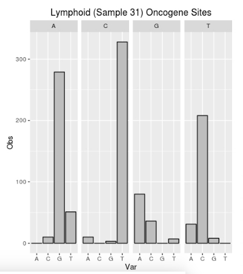
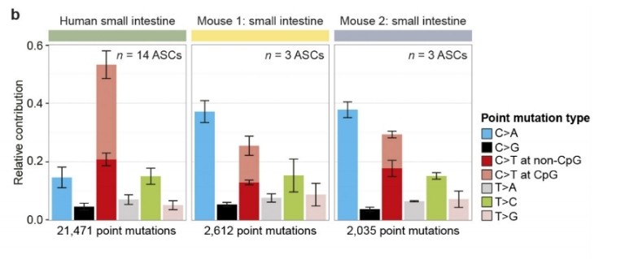
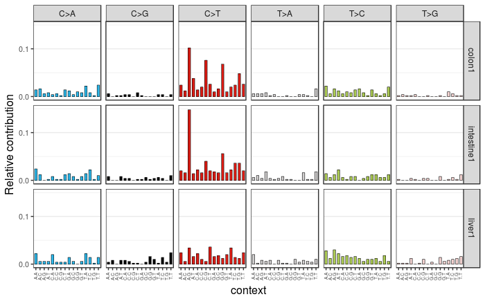

This is intitial analysis of some experimental data to understand what kinds of mutational signatures
are observed, and how they compare with the data found in Alexandrov 2013.

The software being used here is from Blokzijl, Janssen, Van Boxtel, and Cuppen.
Manual: http://bioconductor.org/packages/release/bioc/vignettes/MutationalPatterns/inst/doc/MutationalPatterns.pdf

Dependencies
```{r}
list.of.packages <- c('rmarkdown')
new.packages <- list.of.packages[!(list.of.packages %in% installed.packages()[,"Package"])]
if(length(new.packages)) install.packages(new.packages, dep=TRUE)
```

If Bioconductor needs to be upgraded.
```{r}
source("https://bioconductor.org/biocLite.R")
biocLite("BiocInstaller")
biocLite("BiocUpgrade")
```

Install necessary Bioconductor packages.
```{r}
source("https://bioconductor.org/biocLite.R")
biocLite()
biocLite('BSgenome')
biocLite('MutationalPatterns')
```

Alternatively the newest version can be installed from github.
```{r}
library(devtools)
install_github("UMCUgenetics/MutationalPatterns")
```

Download reference genomes from bioconductor.
```{r}
available.genomes()
biocLite("BSgenome.Hsapiens.UCSC.hg19")
```

Load Necessary Libraries.
```{r}
suppressMessages(library(BSgenome))
suppressMessages(library(MutationalPatterns))
ref_genome <- "BSgenome.Hsapiens.UCSC.hg19"
suppressMessages(library(ref_genome, character.only = TRUE))
```

Once the data is downloaded if can then be manually loaded.
```{r}
vcf_files <- list.files(pattern = ".vcf", full.names = TRUE)

sample_names = c("realData", "realData2")

#vcfs <- read_vcfs_as_granges(vcf_files, sample_names, genome = "hg19")
vcfs <- read_vcfs_as_granges(vcf_files, sample_names, genome = "BSgenome.Hsapiens.UCSC.hg19")
summary(vcfs)
```

The particular base subsitutions can be read in from the specified vcf file into a vcf object in the form of "REF>ALT".
```{r}
head(mutations_from_vcf(vcfs[[1]]), 10)
```

The base changes can also be converted to the 6 conventional base substitution types.
```{r}
head(mutation_types(vcfs[[1]]), 10)
```

In order to retrieve the context in which the mutations appear use the following method.
```{r}
head(mutation_context(vcfs[[1]], ref_genome), 10)
```

The occurances of each triplet can then be counted.
```{r}
type_occurrences <- mut_type_occurrences(vcfs, ref_genome)
print(type_occurrences)
```

The mutation spectrum functions take into consideration the number of occurrences at different sites.
The `plot_spectrum` function plots the mean relative contribution of each of the 6 different base substitution types over multiple samples.
```{r}
# default plot
p1 <- plot_spectrum(type_occurrences)
plot(p1)
```

As an example of the uncorrected bias that I have seen in experimental data, look at the following plot.
I do not yet understand why the two mutation biases do not entirely match.  
 

When the mutation bias is computed using the Stratton lab methods, my experimental bias does appear to be
quite similar to theirs. An example from Alexandrov 2013 is below.  


We can also separate out the C-T changes that have occurred at CpG islands. I think what this illustrates nicely is that
our C-T bias is not as strong as the bias that is observed by other labs, but this appears to be due to the fact that I do
not have an accurate representation of the fraction of the genome that contains CpG sequences within my probed regions.
```{r}
p2 <- plot_spectrum(type_occurrences, CT = TRUE)
plot(p2)
```

Below is the 96 mutation profile for my experimental data. Interestingly the triple
base pair pattern that I observed is essentially the exact opposite of the pattern I
observe in the Stratton lab data. When a pattern of change is more prevalent in their
data, that pattern is less prevalent in my data. For reference, three organs from the
Stratton lab are included after my data.
```{r}
mut_mat <- mut_matrix(vcf_list = vcfs, ref_genome = ref_genome)
plot_96_profile(mut_mat[,c(1,2)])
```

 

7.1 Strand Bias Testing
The idea here is to test whether variants are found on the transcribed or non-transcribed strand.
This may be useful in understanding the involvement of transcription-coupled repair.
The output will be "-" (outside of genes) "T" (transcribed/anti-sense/non-coding strand) and "U" (untranscribed/sense/coding strand).

First download the known gene regions from UCSC
```{r}
# Get ``known genes'' table from UCSC for hg19
biocLite("TxDb.Hsapiens.UCSC.hg19.knownGene")
```

Then load the gene regions.
```{r}
suppressMessages(library("TxDb.Hsapiens.UCSC.hg19.knownGene"))
genes_hg19 <- genes(TxDb.Hsapiens.UCSC.hg19.knownGene)
```

Calculate strand information.
```{r}
strand_from_vcf(vcfs[[1]], genes_hg19)
```

Strand information can then be incorporated into the mutation matrix information.
```{r}
mut_mat_s <- mut_matrix_stranded(vcfs, ref_genome, genes_hg19)
head(mut_mat_s, 10)
```

Strand bias analysis can then be plotted.
```{r}
strand_counts <- strand_occurrences(mut_mat_s, by=tissue)
plot_strand(strand_counts, mode = "relative")
```

8.1 Rainfall Plotting
Rainfall plotting can be used to visualize the distribution of mutations along a genome.
When points fall down towards the x-axis, the genomic distance is greater from ref, and indicative of hotspots.
Below is a rainfall plot of sample 1 over all autosomal chromosomes.
```{r}
# Define autosomal chromosomes
chromosomes <- seqnames(get(ref_genome))[1:22]
# Make a rainfall plot
plot_rainfall(vcfs[[1]], title = names(vcfs[1]),
chromosomes = chromosomes, cex = 1.5)
```

Rainfall plots for each chromosome individually.
```{r}
for (i in c(1,2,4,9,11,12,15,16,17)){
    chromosomes <- seqnames(get(ref_genome))[i]
    x = plot_rainfall(vcfs[[1]], title = names(vcfs[1]),
    chromosomes = chromosomes[1], cex = 2)
    plot(x)
}
```
